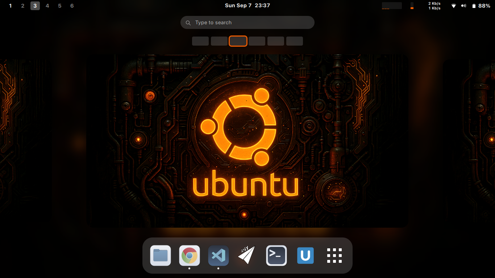
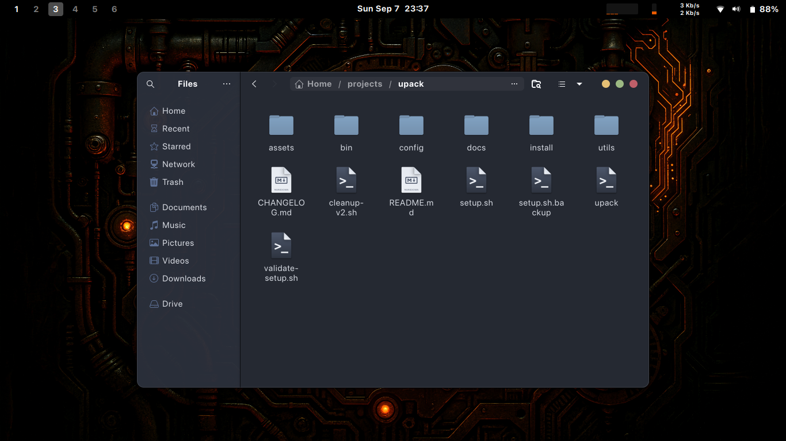
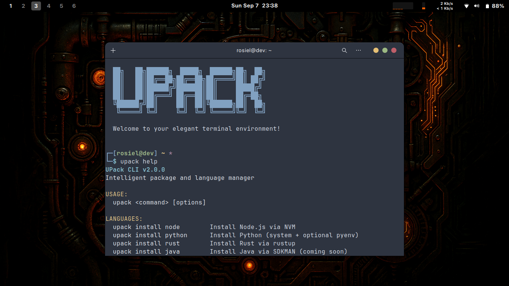

# UPack

UPack is an automated setup and package manager for Ubuntu. It configures a complete development environment from scratch — theme, fonts, apps, terminal — and then gives you a CLI to keep managing things afterward.

The idea is simple: format, clone, run, done. No menus, no questions, no reading through a wiki before you can use your machine.

## Getting started

Clone the repo and run the setup script:

```bash
git clone https://github.com/misterioso013/upack.git
cd upack
./setup.sh
```

Or, if you prefer a one-liner that downloads and runs everything from a temp directory:

```bash
curl -sSL https://raw.githubusercontent.com/misterioso013/upack/main/boot.sh | bash
```

The setup takes around 10-15 minutes. It installs apps, applies the theme, configures the terminal, and drops the `upack` CLI into your PATH. After that, the original folder can be deleted — the installation lives permanently under `~/.local/share/upack/`.

## What gets installed automatically

When you run `./setup.sh`, UPack sets up the following without asking for input:

**Applications**
- Google Chrome
- VS Code
- VLC
- Obsidian
- Xournal++
- GNOME Tweaks and Extension Manager

**Desktop configuration**
- WhiteSur theme (macOS-inspired, works well on GNOME)
- SF Pro Display fonts
- GNOME extensions for dock and workspace management
- Custom keyboard shortcuts (`Super+T` for terminal, `Super+E` for files, etc.)
- Terminal with custom colors and prompt

**UPack infrastructure**
- `upack` CLI globally accessible from any directory
- Desktop launcher for the UPack manager GUI
- `upack-uninstall` for clean removal

## Screenshots

<table>
<tr>
<td align="center">
<strong>Desktop</strong><br/>

<br/>WhiteSur theme with GNOME extensions
</td>
<td align="center">
<strong>Applications menu</strong><br/>

<br/>All essential apps pre-installed
</td>
<td align="center">
<strong>Terminal</strong><br/>

<br/>Customized bash with colors and fonts
</td>
</tr>
</table>

## The CLI

After setup, `upack` is the tool you use to install languages, apps, and configure development tools. It picks the right installer for each thing so you don't end up with conflicting package managers.

```bash
# Check what's installed
upack status

# Install languages
upack install node        # Node.js via NVM
upack install python      # Python (system + optional pyenv)
upack install rust        # Rust via rustup

# Install apps
upack install discord
upack install obs-studio
upack install btop
upack install docker
upack install typora
upack install android-studio

# React Native (installs Android Studio, JDK 17, SDK, emulator, and CLI)
upack install react-native

# Git and GitHub SSH setup
upack git                 # Configures name, email, SSH key, and tests the connection
upack git config          # Only the Git user settings
upack git ssh             # Only the SSH key

# Keep things updated
upack update              # Updates UPack itself and managed packages

# See everything available
upack --help
upack list
```

### React Native in one command

`upack install react-native` sets up the full Android development environment: Android Studio, Java JDK 17, Android SDK Platform 35, a pre-configured Pixel 4 emulator, and React Native CLI. Environment variables are configured automatically.

After installation:

```bash
npx react-native@latest init MyApp
cd MyApp
npx react-native run-android
```

## Requirements

- Ubuntu 22.04 LTS or 24.04 LTS
- Internet connection
- sudo privileges

## Project structure

```
~/.local/share/upack/       # Main installation directory
├── assets/                 # Icons, fonts, wallpapers
├── config/                 # GNOME, terminal, and app configs
├── install/                # Installation scripts
└── utils/                  # Utility functions

~/.local/bin/               # CLI tools (added to PATH automatically)
├── upack                   # Main CLI
├── upack-tui               # Terminal UI
└── upack-uninstall         # Full removal tool
```

## Troubleshooting

**`upack` command not found after setup:**
```bash
echo 'export PATH="$HOME/.local/bin:$PATH"' >> ~/.bashrc
source ~/.bashrc
```

**Starting over:**
```bash
upack-uninstall
git clone https://github.com/misterioso013/upack.git
cd upack && ./setup.sh
```

## Contributing

Contributions are welcome. Check the [Contributing Guide](CONTRIBUTING.md) for details on how to get started, or use the issue templates below:

- [Report a bug](https://github.com/misterioso013/upack/issues/new?template=bug_report.yml)
- [Request a feature](https://github.com/misterioso013/upack/issues/new?template=feature_request.yml)
- [Documentation issue](https://github.com/misterioso013/upack/issues/new?template=documentation.yml)
- [Ask a question](https://github.com/misterioso013/upack/issues/new?template=question.yml)

## Documentation

- [Complete Guide](docs/COMPLETE_GUIDE.md) — detailed documentation with examples and tutorials
- [Quick Reference](docs/QUICK_REFERENCE.md) — essential commands and shortcuts for daily use
- [Changelog](CHANGELOG.md) — version history and release notes

## License

MIT. See [LICENSE](LICENSE) for details.

## Acknowledgments

Inspired by [Omakub](https://omakub.org) by DHH. Uses the [WhiteSur Theme](https://github.com/vinceliuice/WhiteSur-gtk-theme) by vinceliuice and the [Nord Color Scheme](https://github.com/arcticicestudio/nord) by Arctic Ice Studio.

---

<div align="center">

Made with ❤️ for the Ubuntu community

[Star this repo](https://github.com/misterioso013/upack) · [Report bugs](https://github.com/misterioso013/upack/issues) · [Request features](https://github.com/misterioso013/upack/discussions)

</div>