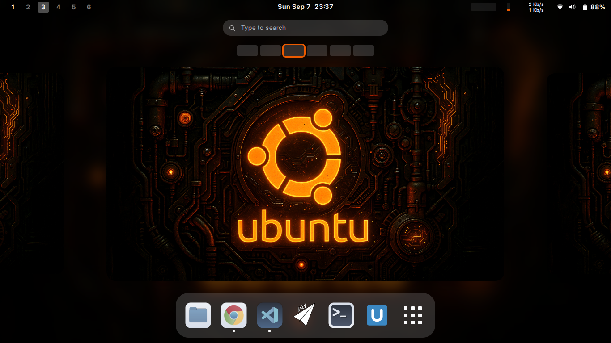
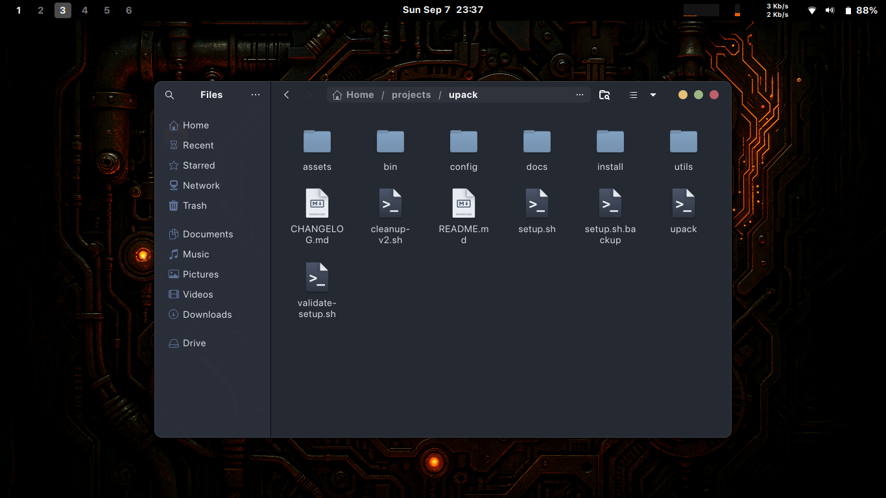
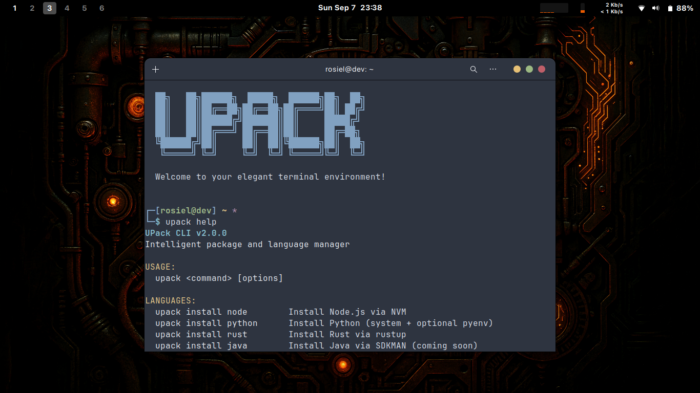

# 🚀 UPack - Complete User Guide

> **"One command. One installation. Ready for war."**

UPack is the ultimate solution to transform your fresh Ubuntu installation into a complete development and productivity environment with just one command.

## 📋 Table of Contents

1. [Quick Installation](#-quick-installation)
2. [What UPack Does](#-what-upack-does)
3. [Installation Modes](#-installation-modes)
4. [Complete Usage Guide](#-complete-usage-guide)
5. [Keyboard Shortcuts](#-keyboard-shortcuts)
6. [Terminal and Aliases](#-terminal-and-aliases)
7. [Programming Languages](#-programming-languages)
8. [Development Tools](#-development-tools)
9. [Configuration & Customization](#-configuration--customization)
10. [Troubleshooting](#-troubleshooting)
11. [Tips & Tricks](#-tips--tricks)

---

## 🎯 Quick Installation

### Quick Installation

```bash
git clone https://github.com/misterioso013/upack.git
cd upack
./setup.sh
```

**⚡ Estimated time:** 15-30 minutes (depending on your connection)

---

## 🎪 What UPack Does

### 🎨 Complete Visual Transformation
- **WhiteSur Theme**: Elegant macOS-style interface
- **Nord Color Scheme**: Consistent colors across the system
- **Nordzy Icons**: Modern and clean icons
- **SF Pro Fonts**: Professional Apple typography
- **Custom Wallpaper**: Ubuntu Neo aesthetic

### 🧩 Essential GNOME Extensions
- **Tactile**: Window management by dragging
- **Just Perfection**: Interface customization
- **Blur My Shell**: Elegant blur effects
- **Space Bar**: Modern workspace indicator
- **TopHat**: System monitor in top bar
- **Alphabetical App Grid**: Apps organized alphabetically

### 💻 Essential Applications
**Required (always installed):**
- Google Chrome
- VS Code (with extensions and settings)
- VLC Media Player
- Xournal++ (note-taking)
- SendAny (file sharing)
- Typora (Markdown editor)
- GNOME Tweaks + Extension Manager
- WL-Clipboard (clipboard)
- Zoxide (smart navigation)

**Optional (your choice):**
- Discord
- OBS Studio
- btop (system monitor)
- TLauncher (Minecraft)
- Advanced terminal configurations

### ⚙️ System Configurations
- **Bash Terminal**: Elegant prompt and useful aliases
- **Alacritty**: GPU-accelerated terminal with themes
- **Productive Hotkeys**: Optimized keyboard shortcuts
- **Git**: Automatic SSH configuration
- **GNOME**: Productivity-optimized settings

## 📸 Visual Preview

See what your Ubuntu system will look like after UPack installation:

<table>
<tr>
<td align="center" colspan="3">
<strong>🖥️ Complete Desktop Experience</strong>
</td>
</tr>
<tr>
<td align="center">

<br/><em>Beautiful WhiteSur theme with GNOME extensions</em>
</td>
<td align="center">

<br/><em>All essential applications pre-installed</em>
</td>
<td align="center">

<br/><em>Customized terminal with colors and productivity features</em>
</td>
</tr>
</table>

---

## 🎛️ Installation Modes

When running `./setup.sh`, you'll see these options:

### 1. 🌟 Full Installation (Recommended)
```
✅ Theme and appearance
✅ GNOME Extensions
✅ Essential applications
✅ Optional applications (interactive choice)
✅ Development configurations
✅ Hotkeys and shortcuts
```

### 2. 🔥 Minimal Installation
```
✅ Essential applications only
✅ Basic configurations
❌ Custom theme
❌ Extensions
❌ Optional apps
```

### 3. 🎨 Desktop Environment Only
```
✅ WhiteSur Theme
✅ GNOME Extensions
✅ Visual configurations
❌ Applications
❌ Development tools
```

### 4. 👨‍💻 Developer Setup
```
✅ Configured VS Code
✅ Optimized terminal
✅ Git configured
✅ Programming languages
✅ Development tools
❌ Theme (keeps Ubuntu default)
```

### 5. 🔧 Custom Installation
Choose component by component what to install.

---

## 🕹️ Complete Usage Guide

### UPack CLI

UPack comes with a powerful command-line interface:

```bash
# View general system status
upack status

# Install applications
upack install discord vscode chrome

# Update all applications
upack update

# List available applications
upack list --available

# List installed applications
upack list --installed

# System monitoring
upack monitor

# Interactive TUI interface
upack-tui

# Apply specific configurations
upack config gnome
upack config terminal
upack config hotkeys

# Backup configurations
upack backup

# System health check
upack doctor

# System cleanup
upack clean

# View system activity
upack activity
```

### 🖥️ Graphical Interface

Search for **"UPack Manager"** in Activities or run:
```bash
upack gui
```

### 🔍 TUI Interface (Terminal)

For an interactive terminal experience:
```bash
upack-tui
```

---

## ⌨️ Keyboard Shortcuts

UPack configures productivity shortcuts inspired by macOS and modern IDEs:

### 🏠 General System
| Shortcut | Action | Description |
|----------|--------|-------------|
| `Super + /` | **Shortcut Help** | Shows all available shortcuts |
| `Super + L` | **Lock Screen** | Locks the session |
| `Super + Q` | **Close App** | Closes current application |
| `Ctrl + Alt + T` | **Terminal** | Opens terminal |
| `Super + E` | **Explorer** | Opens file manager |

### 🪟 Window Management
| Shortcut | Action | Description |
|----------|--------|-------------|
| `Super + ←` | **Snap Left** | Window occupies left half |
| `Super + →` | **Snap Right** | Window occupies right half |
| `Super + ↑` | **Maximize** | Maximizes current window |
| `Super + ↓` | **Restore** | Restores maximized window |
| `Super + M` | **Minimize** | Minimizes current window |
| `Alt + F4` | **Close Window** | Closes current window |
| `Alt + Tab` | **Switch Apps** | Switches between applications |
| `Alt + Shift + Tab` | **Switch Apps (Rev)** | Switches applications (reverse) |

### 🏢 Workspaces
| Shortcut | Action | Description |
|----------|--------|-------------|
| `Super + 1-9` | **Go to Workspace** | Goes to specific workspace |
| `Ctrl + Alt + ←` | **Previous Workspace** | Goes back one workspace |
| `Ctrl + Alt + →` | **Next Workspace** | Goes forward one workspace |
| `Super + Shift + 1-9` | **Move to Workspace** | Moves window to workspace |

### 🎯 Quick Applications
| Shortcut | Action | Application |
|----------|--------|-------------|
| `Super + T` | **Terminal** | Alacritty/Default terminal |
| `Super + B` | **Browser** | Google Chrome |
| `Super + C` | **Code** | VS Code |
| `Super + F` | **Files** | Nautilus |
| `Super + S` | **Search** | GNOME Search |

### 📷 Screenshots
| Shortcut | Action | Description |
|----------|--------|-------------|
| `Print` | **Full Screen** | Screenshot of entire screen |
| `Alt + Print` | **Current Window** | Screenshot of active window |
| `Shift + Print` | **Selected Area** | Screenshot of selected area |

---

## 🖥️ Terminal and Aliases

### 🎨 Custom Prompt

UPack configures an elegant prompt that shows:
- **User@hostname** in colors
- **Current directory** with visual shortcuts
- **Git branch** (when in repository)
- **Git status** (modifications, pending commits)
- **Exit codes** of commands (when different from 0)

### 📝 Essential Aliases

#### 🔄 Modern Commands (when modern tools are installed)
```bash
# Modern replacements
ls    → exa --group-directories-first
ll    → exa -la --group-directories-first
la    → exa -a --group-directories-first
lt    → exa --tree --level=2
cat   → bat --paging=never
less  → bat
find  → fd
grep  → rg (ripgrep)
top   → btm (bottom)
ps    → procs
```

#### 🐙 Git Shortcuts
```bash
gs    → git status
ga    → git add
gc    → git commit
gp    → git push
gl    → git pull
gd    → git diff
gb    → git branch
gco   → git checkout
glog  → git log --oneline --graph --decorate
```

#### 🐳 Docker Shortcuts
```bash
dc    → docker-compose
dps   → docker ps
di    → docker images
```

#### 🐍 Python Shortcuts
```bash
py    → python3
pip   → pip3
serve → python3 -m http.server
json  → python3 -m json.tool
```

#### 🔧 Utilities
```bash
..     → cd ..
...    → cd ../..
....   → cd ../../..
h      → history
c      → clear
reload → source ~/.bashrc
```

### 🌟 Starship Prompt (Optional)

If you installed tools via Rust, you'll have Starship available:

```bash
# Activate Starship (if installed)
eval "$(starship init bash)"
```

---

## 🌐 Programming Languages

UPack offers installation of major languages using recommended managers:

### 📦 Script: `dev-languages.sh`

Run via optional menu or directly:
```bash
./install/apps/optional/dev-languages.sh
```

### 🛠️ Available Languages

#### 🟨 JavaScript/Node.js
- **Installer**: NVM (Node Version Manager)
- **Versions**: LTS automatically
- **Extras**: yarn, pnpm, Vue CLI, Angular CLI, Create React App
```bash
# Commands after installation
node --version
npm --version
nvm list
nvm use 18.17.0
```

#### 🦀 Rust
- **Installer**: rustup (official)
- **Extras**: ripgrep, fd-find, bat, exa, starship, bottom
```bash
# Commands after installation
rustc --version
cargo --version
cargo install <package>
```

#### 🐍 Python
- **Installer**: apt + pipx
- **Versions**: Python 3 (system)
- **Extras**: poetry, black, flake8, mypy, pytest, jupyter
```bash
# Commands after installation
python3 --version
pipx list
pipx install <package>
```

#### ☕ Java
- **Installer**: apt (OpenJDK)
- **Version**: OpenJDK 17 LTS
- **Extras**: Maven, Gradle
```bash
# Commands after installation
java --version
mvn --version
gradle --version
```

#### 🐹 Go
- **Installer**: Official (tar.gz)
- **Version**: Latest stable
```bash
# Commands after installation
go version
go mod init <project>
```

#### 🐘 PHP
- **Installer**: apt
- **Version**: Latest available on Ubuntu
- **Extras**: Composer
```bash
# Commands after installation
php --version
composer --version
```

#### 🔷 C/C++
- **Installer**: apt
- **Tools**: GCC, G++, GDB, CMake, Make, Ninja
```bash
# Commands after installation
gcc --version
g++ --version
cmake --version
```

#### 🔷 .NET
- **Installer**: Microsoft repository
- **Version**: .NET 8
```bash
# Commands after installation
dotnet --version
dotnet new console
```

#### 💎 Ruby
- **Installer**: rbenv
- **Version**: Latest stable
- **Extras**: Bundler
```bash
# Commands after installation
ruby --version
rbenv versions
gem install <gem>
```

#### ⚡ Zig
- **Installer**: GitHub releases
- **Version**: Latest stable
```bash
# Commands after installation
zig version
```

#### 🦕 Deno
- **Installer**: Official (shell script)
- **Version**: Latest stable
```bash
# Commands after installation
deno --version
```

### 🎛️ Management with mise

UPack also installs **mise** for managing multiple versions:

```bash
# mise setup script
./install/apps/optional/mise-setup.sh

# mise commands
mise install python@3.11
mise use python@3.11
mise list
mise ls-remote python
```

---

## 🛠️ Development Tools

### 📦 Script: `dev-tools.sh`

Run via optional menu:
```bash
./install/apps/optional/dev-tools.sh
```

### 🗂️ Available Categories

#### 🖥️ Modern CLI
Modern replacements for classic Unix tools:
- **ripgrep** (rg) → faster grep
- **fd** → simpler find
- **bat** → cat with syntax highlighting
- **exa** → ls with colors and icons
- **bottom** (btm) → prettier top
- **procs** → improved ps
- **starship** → customizable prompt
- **tokei** → count code lines
- **hyperfine** → command benchmarking

#### 🗄️ Databases
- **PostgreSQL Client** (psql)
- **MySQL Client** (mysql)
- **Redis Tools** (redis-cli)
- **MongoDB Tools** (mongosh)
- **SQLite** (sqlite3)
- **pgcli** / **mycli** → improved clients

#### 🐳 Containers & Orchestration
- **Docker** + Docker Compose
- **kubectl** (Kubernetes)
- **Helm** (Kubernetes package manager)

#### ☁️ Cloud Tools
- **AWS CLI** v2
- **Google Cloud SDK** (gcloud)
- **Azure CLI** (az)
- **Terraform** (infrastructure as code)

#### 🌐 APIs & Networking
- **HTTPie** → friendlier curl
- **jq** → JSON processing
- **yq** → YAML processing
- **Postman** → graphical API client
- **nmap**, **netcat**, **dig** → network tools

#### ✏️ Text Editors
- **Neovim** → modern Vim
- **micro** → modern nano
- **Helix** → modern editor inspired by Kakoune

#### 🔧 General Utilities
- **GitHub CLI** (gh)
- **tree** → visualize directories
- **tmux** → terminal multiplexer
- **htop** → process monitor
- **rsync** → file synchronization
- **pandoc** → document conversion

### 💡 Usage Examples

```bash
# Find files
fd "*.py" ~/projects

# View content with highlighting
bat README.md

# List with icons and colors
exa -la --icons

# Prettier system monitor
btm

# Friendly HTTP client
http GET api.github.com/users/misterioso013

# Process JSON
curl -s api.github.com/users/misterioso013 | jq '.name'

# Git in terminal
gitui

# Benchmark commands
hyperfine "grep -r 'pattern' ." "rg 'pattern'"
```

---

## ⚙️ Configuration & Customization

### 🎨 Alacritty Terminal

UPack configures Alacritty with multiple profiles in `~/.config/alacritty/`:

#### 📁 Configuration Files
- `alacritty.yml` → Main configuration
- `theme.toml` → Nord theme
- `font.toml` → Font configuration
- `pane.toml` → Pane configuration

#### 🎨 Available Themes
```bash
# Switch theme
ln -sf ~/.config/alacritty/themes/nord.toml ~/.config/alacritty/theme.toml
ln -sf ~/.config/alacritty/themes/dracula.toml ~/.config/alacritty/theme.toml
```

### 🖱️ GNOME Settings

#### 🔧 Automatically Applied Settings
- Dark mode enabled
- Accent color: orange
- Custom wallpaper
- Dock behavior
- Optimized animations

#### ⚙️ Configuration Commands
```bash
# Apply GNOME settings
upack config gnome

# Configure hotkeys
upack config hotkeys

# Configure dock
bash config/gnome/dock-config.sh
```

### 🎯 VS Code

UPack configures VS Code with:

#### 📦 Essential Extensions
- GitLens
- Prettier
- ESLint
- Python
- Rust
- Live Server
- Bracket Pair Colorizer
- Material Icon Theme
- One Dark Pro (theme)

#### ⚙️ Custom Settings
- Dark theme
- Font: JetBrains Mono
- Formatting settings
- Git settings
- Custom integrated terminal

### 🐚 Shell Configuration

#### 📝 Configuration Files
- `~/.bashrc` → Main Bash configuration
- `~/.bash_aliases` → Custom aliases
- `~/.bash_profile` → Login settings
- `~/.inputrc` → Readline configuration

#### 🔄 Reload Configurations
```bash
# Reload .bashrc
source ~/.bashrc
# or
reload

# Check aliases
alias

# View all shell settings
set
```

---

## 🆘 Troubleshooting

### 🩺 Automatic Diagnosis

```bash
# Check system health
upack doctor

# View detailed status
upack status

# View logs
tail -f ~/.local/share/upack/logs/upack.log
```

### 🐛 Common Issues

#### ❌ PATH not working
```bash
# Check PATH
echo $PATH

# Fix PATH
echo 'export PATH="$HOME/.local/bin:$PATH"' >> ~/.bashrc
source ~/.bashrc

# Check if upack is in PATH
which upack
```

#### ❌ Aliases not working
```bash
# Check if .bash_aliases is being loaded
grep -n "bash_aliases" ~/.bashrc

# Reload aliases
source ~/.bash_aliases
```

#### ❌ GNOME Extensions not loading
```bash
# Restart GNOME Shell
Alt + F2 → type "r" → Enter

# Check extensions
gnome-extensions list

# Reactivate extensions
bash config/gnome/apply-config.sh
```

#### ❌ Terminal not showing colors
```bash
# Check color support
echo $TERM

# Force colors
echo 'export TERM=xterm-256color' >> ~/.bashrc
source ~/.bashrc
```

#### ❌ Git SSH not working
```bash
# Configure SSH
bash config/github/ssh-config.sh

# Test connection
ssh -T git@github.com
```

### 🔧 Repair Commands

```bash
# Reinstall UPack CLI
./install/apps/required/upack-app.sh

# Reconfigure terminal
bash config/terminal/bash-config.sh

# Reconfigure GNOME
bash config/gnome/apply-config.sh

# Clear cache
upack clean
```

### 📋 Logs and Debug

```bash
# View logs in real-time
tail -f ~/.local/share/upack/logs/upack.log

# Debug mode
UPACK_DEBUG=1 upack status

# Verbose mode
./dev.sh
```

---

## 💡 Tips & Tricks

### 🚀 Maximum Productivity

#### ⚡ Quick Shortcuts
- `Super + /` → View all shortcuts (your new best friend)
- `Ctrl + Alt + T` → Quick terminal
- `Super + E` → Quick explorer
- `Alt + Tab` → Switch apps quickly

#### 🎯 Workflow with Workspaces
1. **Workspace 1**: Browser (research/documentation)
2. **Workspace 2**: VS Code (development)
3. **Workspace 3**: Terminal (commands/scripts)
4. **Workspace 4**: Communication (Discord, Slack)

#### 🔄 Optimized Git Workflow
```bash
# Quick status
gs

# Add all + commit + push in sequence
ga . && gc -m "feat: new feature" && gp

# Pretty log
glog --since="2 days ago"
```

### 🛠️ Advanced Development

#### 🐳 Quick Docker Compose
```bash
# Quick up
dc up -d

# Real-time logs
dc logs -f

# Down and clean
dc down -v
```

#### 🔍 Smart Search
```bash
# Search code
rg "function.*user" --type js

# Search files
fd "config" ~/projects

# Search history
history | rg "docker"
```

#### 📊 System Monitor
```bash
# Modern monitor
btm

# Smart disk usage
dust

# Improved processes
procs
```

### 🎨 Advanced Customization

#### 🌈 Customize Prompt
Edit `~/.bashrc` and look for the `PS1` section to customize.

#### 🖥️ Multiple Alacritty Profiles
```bash
# Copy configuration
cp ~/.config/alacritty/alacritty.yml ~/.config/alacritty/work.yml

# Use specific profile
alacritty --config-file ~/.config/alacritty/work.yml
```

#### 🎭 VS Code Themes
```bash
# Install theme via command
code --install-extension zhuangtongfa.Material-theme
```

### 📈 Performance Tips

#### 🚀 Optimize Bash
```bash
# View .bashrc loading time
time (source ~/.bashrc)

# Bash startup profiling
bash -x ~/.bashrc
```

#### 💾 Regular Cleanup
```bash
# Automatic cleanup
upack clean

# Advanced manual cleanup
sudo apt autoremove
sudo apt autoclean
docker system prune -f
```

### 🔐 Security

#### 🔑 Configure SSH properly
```bash
# Generate SSH key (if you don't have one)
ssh-keygen -t ed25519 -C "your-email@example.com"

# Add to ssh-agent
eval "$(ssh-agent -s)"
ssh-add ~/.ssh/id_ed25519

# Test GitHub
ssh -T git@github.com
```

#### 🛡️ Security Settings
```bash
# Check open ports
nmap localhost

# View active connections
ss -tulpn
```

---

## 📚 References and Extra Resources

### 📖 Official Documentation
- [GNOME Extensions](https://extensions.gnome.org/)
- [VS Code Extensions](https://marketplace.visualstudio.com/)
- [Alacritty Configuration](https://alacritty.org/config-alacritty.html)

### 🛠️ Mentioned Tools
- [ripgrep](https://github.com/BurntSushi/ripgrep)
- [fd](https://github.com/sharkdp/fd)
- [bat](https://github.com/sharkdp/bat)
- [exa](https://github.com/ogham/exa)
- [bottom](https://github.com/ClementTsang/bottom)
- [starship](https://starship.rs/)
- [mise](https://mise.jdx.dev/)

### 🎨 Themes and Inspiration
- [WhiteSur Theme](https://github.com/vinceliuice/WhiteSur-gtk-theme)
- [Nord Color Palette](https://www.nordtheme.com/)
- [Nordzy Icons](https://github.com/alvatip/Nordzy-icon)

---

## 🎉 Conclusion

With UPack, you have everything you need to be productive from the first minute. This guide covers 99% of use cases, but remember:

> **"The best tool is the one you use."**

Don't feel obligated to use everything at once. Explore gradually and find your ideal workflow.

### 🆘 Need Help?

1. `upack --help` → Quick help
2. `upack doctor` → Diagnosis
3. This guide → Complete reference
4. [GitHub Issues](https://github.com/misterioso013/upack/issues) → Community support

---

**💚 Made with love for the Ubuntu community**

*Happy coding! 🚀*
